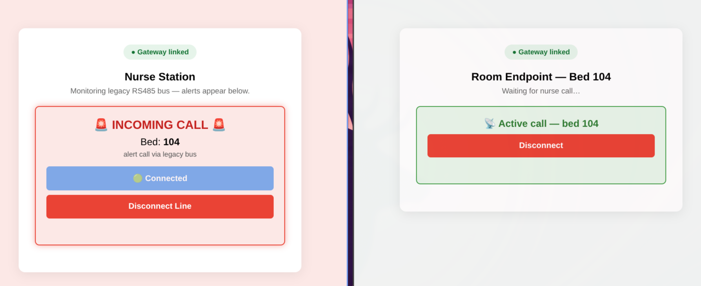

# Open Nurse Gateway (ONG)

[](https://opensource.org/licenses/MIT)
[](https://nodejs.org/)

**Open Nurse Gateway** is a software-defined, open-source middleware gateway that bridges mission-critical legacy nurse call systems into modern cloud-native topologies, mobile Progressive Web Apps (PWAs), and real-time WebRTC communication layers.

By decoupling the asynchronous hardware control plane from the real-time audio transport layer, legacy clinical networks can achieve smartphone-native, echo-cancelled voice intercom with **zero structural rewiring**, minimal capital expenditure, and complete liability isolation for primary OEMs.



---

## ⚡ The Problem & Solution

### The Legacy Deadlock

Older nurse call installations rely on rugged RS485 serial buses and dedicated analog voice lines. Their telemetry is highly reliable, but they lack the mobility and digital voice capabilities required by modern clinical workflows.

### The Software-Defined Paradigm Shift

Open Nurse Gateway circumvents physical bus constraints via a **Data Abstraction Layer (DAL)**:

1. **TCP Ingest** — A legacy hardware controller (or the included mock) connects over TCP and streams ATC-style frames (`ATC 0066 0066\n`). The gateway parses them into JSON telemetry:

   ```json
   { "bed": "102", "type": "Emergency", "timestamp": 1783382400000 }
   ```

2. **WebSocket Broadcast** — Telemetry is pushed to all connected nurse clients over WebSocket as an `alert` message.

3. **WebRTC Selective Signaling** — When a nurse answers, the gateway routes an SDP offer to the specific room endpoint identified by `bedId`. Audio flows peer-to-peer, bypassing the gateway entirely. Echo cancellation runs in the browser.

---

## 🛠️ Architecture

```
+---------------------+      +---------------------------+      +--------------------+
| Legacy RS485 / Mock |      | Open Nurse Gateway (Node) |      |  Nurse Client (PWA)|
+---------------------+      +---------------------------+      +--------------------+
         |                              |                              |
         |-- TCP: ATC 0066 0066\n ----->|                              |
         |                              |-- WebSocket: alert(bed:102)->|
         |                              |                              |-- Answer pressed
         |                              |<-- WS: offer(callId, SDP) --|
         |                              |-- WS: offer forwarded ------>|  Room Endpoint
         |                              |<-- WS: answer --------------|
         |                              |-- WS: answer forwarded ----->|
         |                              |                              |
         |                              |      WebRTC P2P audio ======>|
```

### Modules

| Module | Responsibility |
|---|---|
| `src/config.js` | Env-variable config with typed defaults and fail-fast validation |
| `src/logger.js` | Zero-dep structured JSON logger (stdout, one line per event) |
| `src/parser.js` | Pure ATC frame parser — LF/CRLF, cross-chunk buffering, redundancy check |
| `src/ingest.js` | TCP server for legacy source connections — ACK/NAK per frame, oversize guard |
| `src/schema.js` | WebSocket wire message validator — drops unknown/malformed messages |
| `src/auth.js` | WS upgrade auth — origin allowlist + optional bearer token |
| `src/gateway.js` | Signaling core — client sessions, call routing, rate limiting |
| `server.js` | Bootstrap — wires all modules, HTTP routes, mock injector |
| `scripts/mock-legacy-source.js` | Standalone TCP client simulating an RS485 hardware controller |

---

## 🚀 Quick Start

### Prerequisites

- [Node.js](https://nodejs.org/) v20+

### Install

```bash
git clone https://github.com/chuanjin/open-nurse-gateway.git
cd open-nurse-gateway
npm install
```

### Run with built-in mock injector

```bash
MOCK_INJECTOR_ENABLED=1 node server.js
```

Open two browser tabs:

- **Nurse tab**: `http://localhost:3000/`
- **Room tab**: `http://localhost:3000/?role=room&bedId=102`

After ~15 seconds the mock injector fires an alert for bed 102. Hit **Answer** on the nurse tab to start WebRTC signaling.

### Run with standalone mock source

```bash
# Terminal 1
node server.js

# Terminal 2
node scripts/mock-legacy-source.js
```

Or both together:

```bash
npm run start:with-mock-source
```

---

## 🖥️ Client Roles

The single `index.html` serves both roles, detected from URL parameters:

| URL | Role | Behaviour |
|---|---|---|
| `http://localhost:3000/` | **Nurse** | Receives alerts, answers calls, initiates WebRTC offer |
| `http://localhost:3000/?role=room&bedId=102` | **Room endpoint** | Registered as bed 102, receives offer, sends answer |

---

## ⚙️ Configuration

All configuration is via environment variables. Defaults produce a working PoC with no env set.

| Variable | Default | Description |
|---|---|---|
| `PORT` | `3000` | HTTP + WebSocket listen port |
| `INGEST_PORT` | `4001` | TCP port for legacy source connections |
| `INGEST_ENABLED` | `1` | Set to `0` to disable TCP ingest |
| `INGEST_BIND_HOST` | `127.0.0.1` | Bind address for TCP ingest |
| `INGEST_MAX_LINE_BYTES` | `512` | Max bytes per ingest frame line |
| `AUTH_TOKEN` | _(none)_ | If set, WS clients must supply `?token=<value>` |
| `ALLOWED_ORIGINS` | `http://localhost:3000,http://127.0.0.1:3000` | Comma-separated WS origin allowlist, or `*` |
| `ICE_SERVERS` | Google STUN | JSON array, e.g. `[{"urls":"stun:stun.example.com:3478"}]` |
| `MSG_MAX_BYTES` | `65536` | Max WebSocket message size (bytes) |
| `RATE_LIMIT_PER_SEC` | `50` | Max WS messages per second per client |
| `MOCK_INJECTOR_ENABLED` | `0` | Set to `1` to enable random alert injection |
| `MOCK_INJECTOR_INTERVAL_MS` | `15000` | Interval between mock alerts (ms) |
| `LOG_LEVEL` | `info` | One of `error`, `warn`, `info`, `debug` |

---

## 🧪 Tests

```bash
npm test
```

Uses the Node.js built-in `node:test` runner — no extra dependencies needed.

| Test file | Coverage |
|---|---|
| `tests/parser.test.js` | Frame parsing, redundancy check, streaming buffer |
| `tests/schema.test.js` | Wire message validation for all message types |
| `tests/auth.test.js` | Origin allowlist, bearer token extraction, constant-time compare |
| `tests/config.test.js` | Env parsing, ICE JSON validation, fail-fast on bad input |
| `tests/gateway.test.js` | Offer routing, answer, candidate, hangup, rate limit, size limit |
| `tests/ingest.test.js` | TCP ACK/NAK, cross-chunk framing, oversize kill, concurrent sources |
| `tests/server.test.js` | HTTP routes, security headers, WS upgrade auth integration |

---

## 🔌 Wire Protocol

WebSocket messages are JSON objects with a `type` field. The gateway validates all inbound messages — unknown or malformed messages are silently dropped.

### Client → Server

| Type | Required fields | Description |
|---|---|---|
| `hello` | `role` (`nurse`\|`room`), `bedId` (string, room only) | Register identity after connect |
| `offer` | `callId` (UUID string ≤64), `sdp`, `targetBed` | Nurse initiates call to a room bed |
| `answer` | `callId`, `sdp` | Room responds to offer |
| `candidate` | `callId`, `candidate` (object) | ICE candidate exchange |
| `hangup` | `callId` | End call |

### Server → Client

| Type | Fields | Description |
|---|---|---|
| `welcome` | `clientId`, `iceServers` | Sent on connect — confirms session ID and ICE config |
| `alert` | `bed`, `type`, `timestamp` | Legacy telemetry broadcast to nurses |
| `offer` | `callId`, `sdp` | Forwarded offer (server → room) |
| `answer` | `callId`, `sdp` | Forwarded answer (server → nurse) |
| `candidate` | `callId`, `candidate` | Forwarded ICE candidate |
| `hangup` | `callId` | Call terminated (by peer or on disconnect) |
| `error` | `callId`, `reason` | Signaling error (e.g. `target-offline`, `duplicate-callId`) |

### TCP Ingest (legacy source → gateway)

Frames are ASCII lines terminated with `\n` or `\r\n`:

```
ATC 0066 0066\n   → Emergency, bed 102
NRS 00CD 00CD\n   → Nurse call, bed 205
STF 012D 012D\n   → Staff call, bed 1-45
```

Prefixes: `ATC` = Emergency, `NRS` = Nurse, `STF` = Staff. The 4-hex-char address is doubled for redundancy — mismatched halves are rejected. The gateway responds `ACK\n` on success, `NAK\n` on malformed frames, and destroys the connection on oversize lines.

---

## ⚠️ Production Considerations

### HTTPS Required

Browsers require a Secure Context (HTTPS) for microphone access (`getUserMedia`). For LAN deployments, place the gateway behind a TLS termination proxy (Nginx, Caddy, Traefik) or provision self-signed certificates.

### User Gesture Restriction

Mobile browsers block microphone activation from asynchronous WebSocket messages. The UI maps inbound alerts to an explicit **Answer** tap, ensuring hardware initialization is anchored to a direct user gesture.

### Regulatory Separation

Under European medical device regulations, modifying primary life-safety nurse call controller software requires costly recertification. By running Open Nurse Gateway as a sidecar — without touching the primary hardware — facilities maintain the OEM's certified software boundary. The MIT license explicitly provides the gateway "AS IS" with no warranty, supporting clear liability isolation.

---

## 📄 License

This project is licensed under the [MIT License](LICENSE) - see the file for details.
