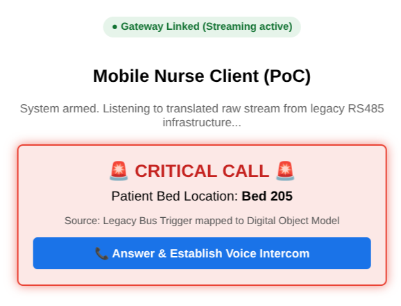
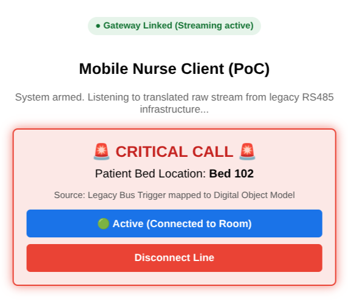

# Open Nurse Gateway (ONG)

[](https://opensource.org/licenses/MIT)
[](https://nodejs.org/)

**Open Nurse Gateway** is a software-defined, open-source middleware gateway designed to bridge mission-critical legacy nurse call systems directly into modern cloud-native topologies, mobile Progressive Web Apps (PWAs), and real-time WebRTC communication layers.

By decoupling the asynchronous hardware control plane from the real-time audio transport layer, this architecture enables legacy clinical networks to achieve modern smartphone-native, echo-cancelled voice intercom with **zero structural rewiring**, minimal capital expenditure, and complete liability isolation for primary OEMs.

## ⚡ The Challenge & Solution

### The Legacy Deadlock

Across healthcare facilities and care homes, older nurse call installations represent massive unamortized capital investments. These platforms rely on rugged physical topologies like **RS485 serial buses** and dedicated analog voice lines. While their telemetry is highly reliable, they lack the native mobility and modern digital voice capabilities required by modern clinical workflows.

### The VoIP Retrofit Fallacy

Prior modernization attempts involved "forklift upgrades" or trying to run Voice over IP (VoIP) packets directly onto low-baud serial bus frames (e.g., trying to encapsulate audio within serial commands). These universally fail due to:

- **Bandwidth Saturation:** Overloading low-baud rates (typically 9600 Baud).
- **Hardware Buffer Overflows:** Crashing legacy micro-controllers.
- **Acoustic Feedback Loops:** Extreme howling due to lack of echo cancellation.

### The Software-Defined Paradigm Shift

Open Nurse Gateway circumvents physical bus constraints via a **Data Abstraction Layer (DAL)**. The copper wiring is left uncompromised. The gateway acts as a high-speed translator:

1. **Asynchronous Ingest:** Translates proprietary serial bus strings (like `ATC XXYY XXYY`) into web-standard JSON telemetry objects:

   ```json
   {
     "bed": "102",
     "type": "Emergency",
     "timestamp": 1783382400000
   }
   ```

2. **WebRTC Selective Signaling Engine:** When a call is answered, WebRTC initiates a peer-to-peer (P2P), encrypted audio link directly between the ward room endpoint and the nurse's mobile device, completely bypassing the gateway for audio transmission and offloading echo cancellation directly to the modern browser engine.

---

## 🛠️ Key Architectural Components

### 1. Asynchronous Control Plane Ingestion

Monitors the legacy serial bus via an isolated TCP socket or serial connection (utilizing `serialport`).

### 2. Selective WebSockets Signaling

Manages connections and tags instances with unique Client IDs (`crypto.randomUUID()`). A **custom selective broadcaster** is implemented to prevent signaling feedback loops (loopback) by forwarding WebRTC SDP handshakes only to other peer clients.

### 3. Client Voice DSP Constraints

Enforces advanced audio constraints to suppress physical feedback loops:

- **Echo Cancellation** & **Noise Suppression**
- **Auto Gain Control**
- **Mono channel configuration** to reduce processing overhead.
- **16kHz wideband voice** optimized for speech clarity over standard Wi-Fi.

---

## 🗺️ System Topology

```text
+-------------------+      +---------------------------+      +--------------------+      +-------------------------+
| Legacy RS485 Bus  |      | Open Nurse Gateway (Node) |      | Nurse Client (PWA) |      | Room Endpoint Simulator |
+-------------------+      +---------------------------+      +--------------------+      +-------------------------+
          |                              |                              |                              |
          |--- (1) RS485 Interrupt ----->|                              |                              |
          |    Bed 102 Calling           |                              |                              |
          |    (ATC command)             |                              |                              |
          |                              |-- [Parse telemetry to JSON]  |                              |
          |                              |                              |                              |
          |                              |--- (2) WebSocket Broadcast ->|                              |
          |                              |    Bed 102 Emergency         |                              |
          |                              |                              |-- [Highlight UI red &]       |
          |                              |                              |   [Prompt user gesture]      |
          |                              |                              |                              |
          |                              |<-- (3) WebSocket Offer ------|                              |
          |                              |    (WebRTC, Client A ID)     |                              |
          |                              |                              |                              |
          |                              |--- (4) Forward Offer (Selective Broadcast) ---------------->|
          |                              |                                                             |
          |                              |<-- (5) WebSocket Answer (WebRTC, Client B ID) --------------|
          |                              |                              |                              |
          |                              |--- (6) Forward Answer ------>|                              |
          |                              |    (Selective Broadcast)     |                              |
          |                              |                              |                              |
          |                              |                              |<== (7) WebRTC P2P ICE ======>|
          |                              |                              |    Negotiation               |
          |                              |                              |                              |
          |                              |                              |<============================>|
          |                              |                              |  (8) Secure, Echo-Cancelled  |
          |                              |                              |      P2P Voice Stream        |
```

---

## 🚀 Quick Start (Development / PoC Simulator)

This repository includes a fully functional local simulator containing a Node.js signaling server and an HTML5 dashboard.

### Prerequisites

- [Node.js](https://nodejs.org/) (v16+)

### Installation

1. Clone the repository:

   ```bash
   git clone https://github.com/chuanjin/open-nurse-gateway.git
   cd open-nurse-gateway
   ```

2. Install dependencies:

   ```bash
   npm install
   ```

### Running the Simulator

1. Launch the server:

   ```bash
   node server.js
   ```

2. Open your browser and navigate to:
   [http://localhost:3000](http://localhost:3000)
3. Open a second, separate browser window/tab at [http://localhost:3000](http://localhost:3000) to simulate another client.
4. Wait 15 seconds. The server's built-in **PoC Mock Interrupt Injector** will trigger a random bed alert.
5. Tap **Answer & Establish Voice Intercom** on one screen to begin WebRTC signaling and establish local P2P audio loop.

#### Interface Preview

|      1. Inbound Call Alert      |        2. Active Intercom Line         |
| :-----------------------------: | :------------------------------------: |
|  |  |

---

## ⚠️ Important Production Considerations

### 1. HTTPS Context Execution

Web browsers require a **Secure Context (HTTPS)** to access microphone hardware (`navigator.mediaDevices.getUserMedia`). For production deployments on Local Area Networks (LAN), the gateway must be deployed behind a TLS termination proxy (such as Nginx, Caddy, or Traefik) or provisioned with valid certificates.

### 2. User Gesture Restrictions

Mobile web sandboxes block automated background audio playbacks or microphone activation triggered by asynchronous WebSocket messages. The application explicitly maps inbound signaling to an **interactive user tap ("Answer")**, ensuring hardware initialization is anchored to a direct user gesture.

### 3. Regulatory and Liability Separation

Under European medical device regulations, updating proprietary software on primary life-safety nurse call controllers is subject to complex and costly recertification.
By releasing the Open Nurse Gateway under the permissive **MIT License**, the core software is provided "AS IS" with no warranty. This allows primary manufacturers to successfully isolate compliance boundaries and legal liability when bridging legacy hardware to modern IP topologies.

---

## 📄 License

This project is licensed under the [MIT License](LICENSE) - see the file for details.
